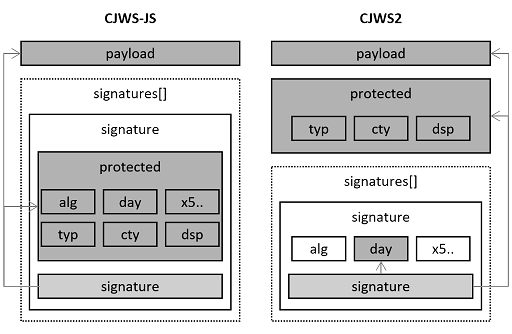

# LIONS
Research project of the University of the Bundeswehr (German Federal Armed Forces)

LIONS is an interdisciplinary research project dealing with Digital Sovereignty, Resilience, Distributed Ledger Technology and Digital Identities. It builds technical and analytical competencies, provides a lab environment with real-world DLT infrastructure, and builds a community from the armed forces, government agencies, and the private sector.

Karl Seidenfad, Michael Hofmeier, Ulrike Lechner @ CODE Annual Convention

LIONS is funded by dtec.bw – Digitalization and Technology Research Center of the Bundeswehr. dtec.bw is funded by the European Union – NextGenerationEU.

# CJWS - Certificate-based Json Web Signature
This is an **EXPERIMENTAL** and **UNOFFICIAL** extension/modification of the standardized Json Web Signatures ([JWS - RFC7515](https://www.rfc-editor.org/rfc/rfc7515)).

A CJWS can only be created/signed using a valid PKI certificate (not self-signed) that can be verified by its X.509 chain.
As consequence a CJWS can be used for proofs/attestations.

This format can be used for (half-)automated processes, where the receiver does not know the sender. The PKI enables the receiver to verify the identity of the sender and the validity of the data.
Also the CJWS2 format allows the data to be signed by multiple instances, each with its own certificate, and still compact serialization.

In this project two types of Certificate-based Json Web Signatures are defined:
- [CJWS1](#cjws1): compatible with the [JWS - RFC7515](https://www.rfc-editor.org/rfc/rfc7515)
- [CJWS-JS](#cjws-js): compatible with the [JWS - RFC7515](https://www.rfc-editor.org/rfc/rfc7515)
- [CJWS2](#cjws2): extended/modified JWS strcuture, not compatible

### Example Scenario

The german T-prescription was implemented as an application scenario, since it involves special requirements for signatures, data protection and data transfer. For this scenario, all the necessary applications and libraries are implemented in simple form.

[-> Prescription Scenario](CJWS/PrescriptionScenario)

### Library

A .NET library for serializing and deserializing CJWS documents has also been implemented.

[-> Library](CJWS/CJWS)

# CJWS1

## The document
A CJWS1 document consists of the following parts:
- Header
- Payload
- Signature

The element of the document is serialized to URL-safe base64 string.  
The strings are combined/joined using the '.' character:
~~~
{HEADER}.{PAYLOAD}.{SIGNATURE}
~~~

## Header
~~~
{
    "typ": "cjws1",
    "cty": "example-document-type",
    "dsp": "Display Text",
    "alg": "RS512",
    "x5c": "...[BASE64]...",
    "day": "2023/03/31"
}
~~~
The header is compatible to a JWS header.

- **typ**: The type of the document -> should always be cjws1.
- **cty**: The payload content type; used by the applications.
- **alg**: The algorithm algorithm used to create the signature (this property is informative).  
Valid values are: RS256, RS384, RS512, ES256, ES384, ES512.
- **x5c**: The certificate file (CRT, no private key) as base64 encoded byte array.
- **day**: The signature date as string in yyyy/MM/dd format.

## Payload
The payload can either be an object serialized to a json string given as UTF-8 byte array or a binary.   
The content type in the header should be set accordingly.

## Signature
The digital signature (of header + '.' + payload) as base64 encoded byte array.

The contained certificate should be validated against its X.509 chain.  
It also allows validating the digital signature for the given header and payload.

A document is valid if the certificate and digital signature are valid.

# CJWS-JS

## The document
A CJWS2 document consists of the following parts:
- Payload
- Signature(s)

## Payload
The payload can either be an object serialized to a json string given as UTF-8 byte array or a binary.   
The content type in the header should be set accordingly.

## Signature
~~~
{
    "protected": "...[BASE64]...",
    "signature": "...[BASE64]..."
}
~~~
Signature's protected header (same like the CJWS1 header):
~~~
{
    "typ": "cjws-js",
    "cty": "example-document-type",
    "dsp": "Display Text",
    "alg": "RS512",
    "x5c": "...[BASE64]...",
    "day": "2023/03/31"
}
~~~

# CJWS2

## The document
A CJWS2 document consists of the following parts:
- Header
- Payload
- Signature(s)

The element of the document is serialized to URL-safe base64 string.  
The strings are combined/joined using the '.' character:
~~~
{HEADER}.{PAYLOAD}.{SIGNATURE1}.{SIGNATURE2} ...
~~~

This format allows the extraction of the header without reading the complete stream or file and also multiple signatures at different points in time.

## Header
~~~
{
    "typ": "cjws2",
    "cty": "example-document-type",
    "dsp": "Display Text"
}
~~~
The header is compatible to a JWS header.

- **typ**: The type of the document -> should always be cjws2.
- **cty**: The payload content type; used by the applications.

## Payload
The payload can either be an object serialized to a json string given as UTF-8 byte array or a binary.   
The content type in the header should be set accordingly.

## Signature
~~~
{
    "alg": "RS512",
    "x5c": "...[BASE64]...",
    "sig": "...[BASE64]...",
    "day": "2023/03/31"
}
~~~
The document can contain multiple signature object. Each signature object has the following properties:

- **alg**: The algorithm algorithm used to create the signature (this property is informative).  
Valid values are: RS256, RS384, RS512, ES256, ES384, ES512.
- **x5c**: The certificate file (CRT, no private key) as base64 encoded byte array.
- **sig**: The digital signature (of header, payload and day parameter) as base64 encoded byte array.
- **day**: The signature date as string in yyyy/MM/dd format.

The contained certificate should be validated against its X.509 chain.  
It also allows validating the digital signature for the given header, payload and date.

A document is valid if ALL certificates and digital signatures are valid.

## Comparison CJWS-JS (JWS) and CJWS2
The following figure shows the differencesof the JWS compatible format CJWS-JS and the JWS modification CJWS2 in terms of data protection:

